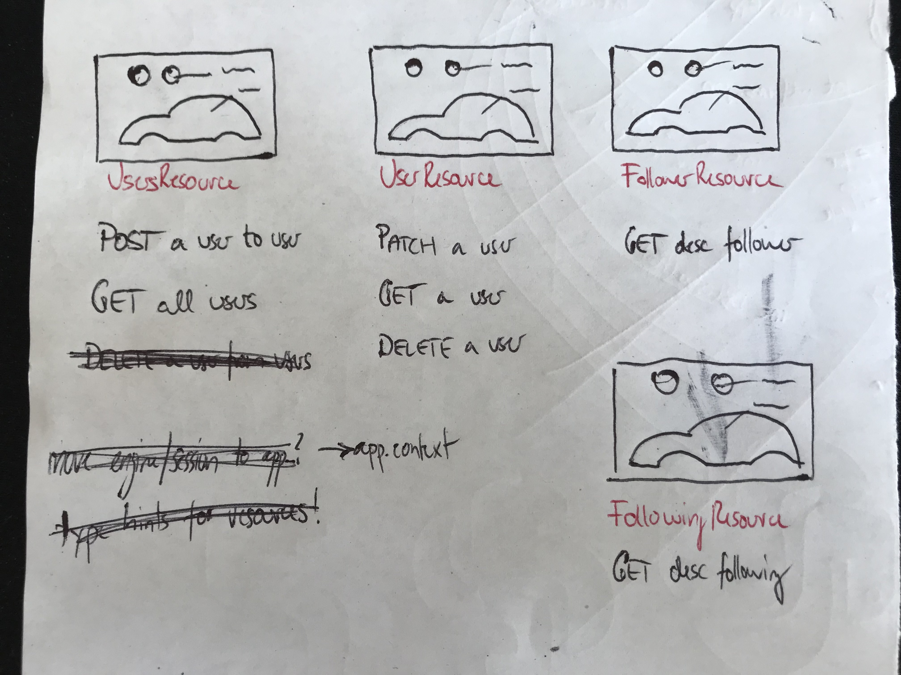
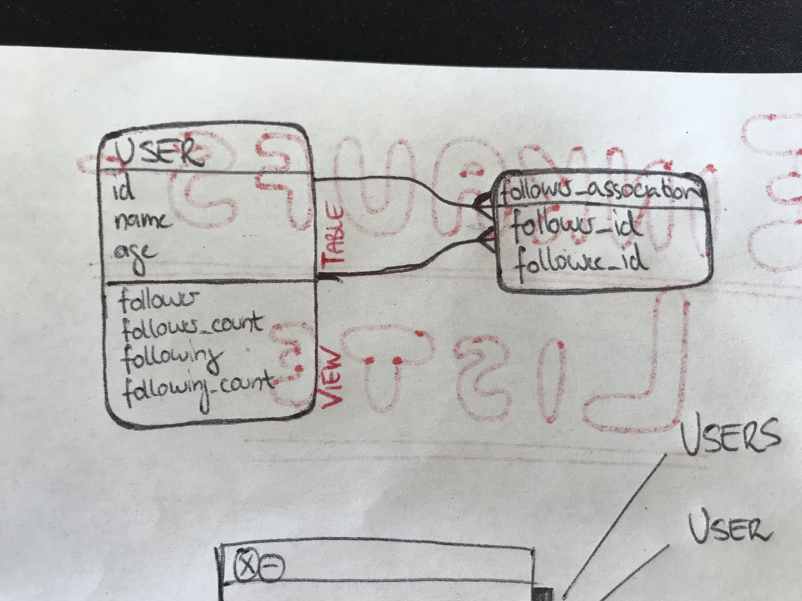
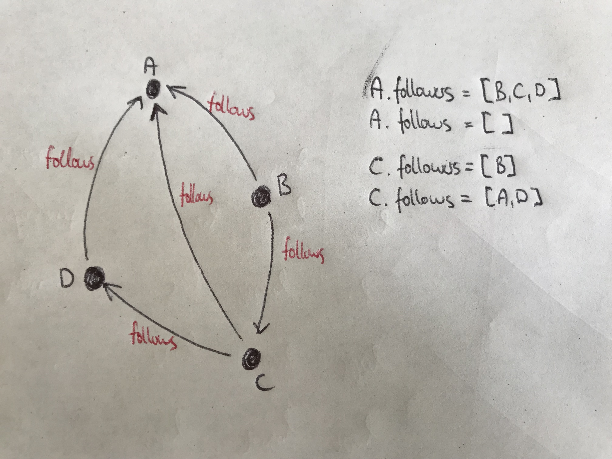

## The API

  

*Resources and HTTP methods for all endpoints.*

## The UserSchema

  

*Schema to (de)serialize UserModel-objects.*

## The UserModel

  

*UserModel and follower_association-Table for many-to-many  
relationship.*

## The Follower Graph

  

*Follower and following as a directed graph.*
