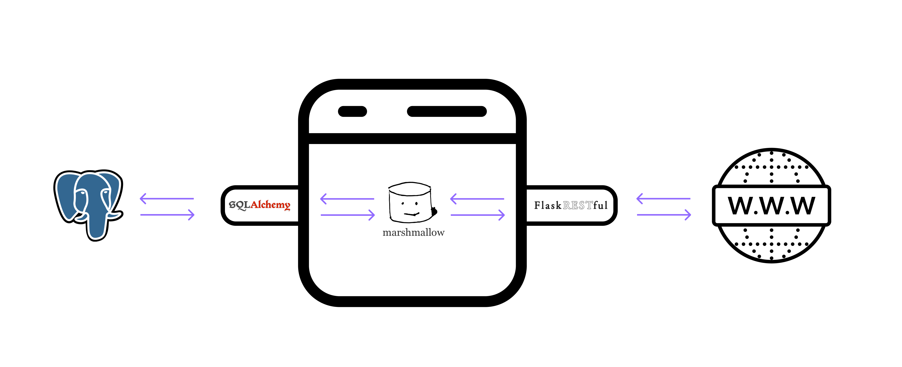

# PORTFOLIO REST API
*A minimal REST API using [Flask](https://flask.palletsprojects.com/en/2.1.x/)*

[**Architecture**](#architecture) |
[**API Endpoints**](#api-endpoints) |
[**Examples**](#examples) 

## **Architecture**
  

## **API Endpoints**
/users - Methods: [GET, POST]  
/user - Methods: [GET, PATCH, DELETE]  
/following - Methods: [GET, PATCH]  
/follower - Methods: [GET]

## **Examples** 

***Get all users***
```
curl localhost:5002/users
```
***Create a new user***
```
curl localhost:5002/users -X POST -d 'name=...&age=...'
```
***Get a specific user***
```
curl localhost:5002/user/... 
```
***Update a specific user***
```
curl localhost:5002/user/... -X PATCH -d 'name=...'
curl localhost:5002/user/... -X PATCH -d 'age=...'
curl localhost:5002/user/... -X PATCH -d 'name=...&age=...'
```
***Delete a specific user***
```
curl localhost:5002/user/... -X DELETE
```
***Get all users ordered by their following count***
```
curl localhost:5002/following
```
***Update a user to follow another one***
```
curl localhost:5002/following -X PATCH -d 'follower_id=...&followee_id=...'
```
follower_id: the user that is following the other user  
followee_id: the user that is getting a new follower  

***Get all user ordered by their follower count***
```
curl localhost:5002/follower 
```

